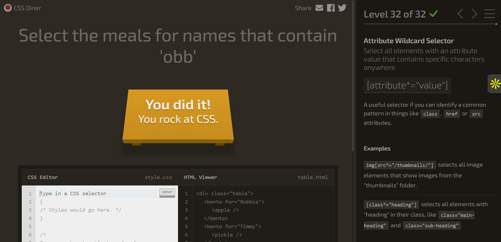

advanced CSS topics
• pseudo-classes (e.g., :hover, :focus)
• CSS transitions
• CSS variables (custom properties)

practice: interests page
• create interests.html
• create and edit css/interests.css
• use classes, hover effects, transitions, variables

CSS Diner game
• play through levels to practice selectors
• finish game and attach png